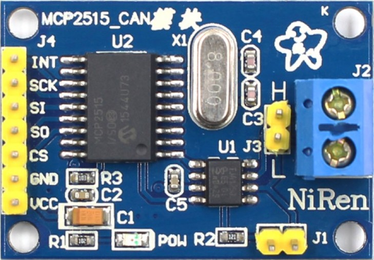

# nano-can
This repository has the arduino code for use with nano can PCB.
 These were created as a cheap device for people to get into car hacking.
  <b>I take no responsibility for any issues caused if using either the hardware or the code</b>
  Requires the use of the following Arduino library
  https://github.com/coryjfowler/MCP_CAN_lib
  The sketch is configured for the OBD2 port speed (500kbps) and will listen to the can bus starting with CAN ID 0x128. Both can be changed in the code.
 Whilst on the serial monitor it will show the changes between the messages
  u and d will change the CAN ID up or down by 1
 U and D will change the CAN ID up or down by 16
 h shows the above information

Note:
 Arduino Nano goes on the top with the URL on.

 MCP2515 Module goes on the bottom but DO NOT solder the Terminator Jumper or CAN pin headers to the PCB
 You may require a jumper on the Terminator resistor

 Completed Top

 Completed Bottom

 OBD2 connector

 PCB Top 

 PCB Bottom 

